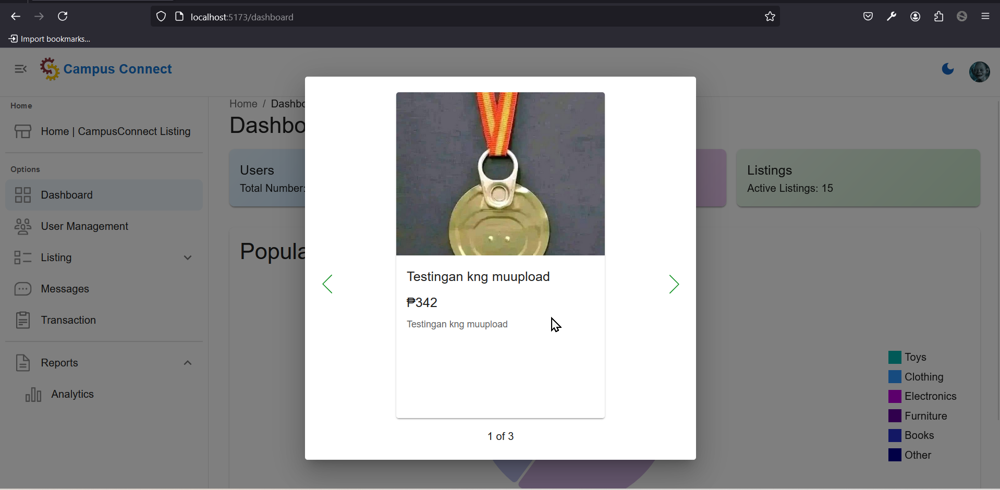
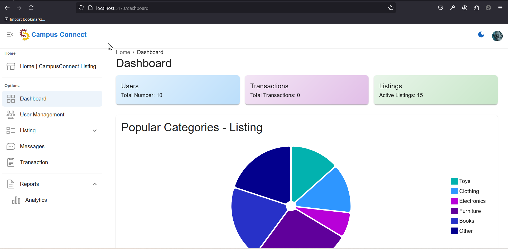
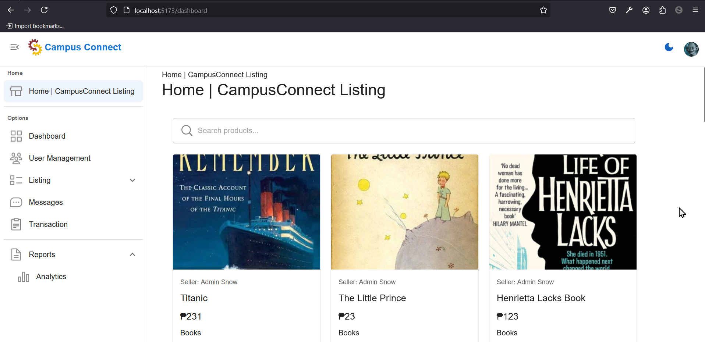

# <span style="font-family: 'Arial', sans-serif; font-weight: bold; color: #2E8B57;">**Campus Connect**: Your One-Stop Shop for Student Life</span>


**CSIT321G2 - App Dev**<br>
**CSIT340 - Industry Elective 1****

**Members: <br>**
_Paulo Carabuena<br>
Neil Adrian Bas<br>
Jenelyn Mendoza<br>_

## Features

- **Secure Login/Logout**: University email verification for user authentication
- **E-commerce Marketplace**:
   - Basic product/service listings with descriptions and images
   - Simple buy/sell functionality
- **Direct Messaging**: Basic communication between buyers and sellers
- **Search Functionality**: Simple search to find products and services
- **CampusConnectDashboard (for admin)**:
   - Basic overview of platform activity
   - User account management
   - Basic content moderation
- **Analytics**:
   - **For Students**:
      - Number of items sold/services booked
      - Total earnings
   - **For Admin**:
      - Number of active listings
      - Most popular product/service categories


### Instructions for Setting Up the CampusConnect Project in IntelliJ IDEA on Windows

1. **Clone the repository by clicking `Get from VCS`**:
    - URL: `https://github.com/pawekz/campusconnect.git`

2. **IntelliJ IDEA will automatically download and install the Java dependencies listed in the `pom.xml` file, just click `Load Maven Project`**.

3. **Open the Terminal within IntelliJ IDEA** (`View` > `Tool Windows` > `Terminal`).

4. **Navigate to the frontend directory (if applicable)**:
    ```sh
    cd campusconnect-react
    ```

5. **Install JavaScript dependencies**:
    ```sh
    npm install
    ```

6. In the configuration ([Environment Variables](https://www.jetbrains.com/help/objc/add-environment-variables-and-program-arguments.html#add-environment-variables), copy and paste and adjust accordingly especially the username and password):
    ```LOGGING_LEVEL_ROOT=INFO;SERVER_PORT=8080;SPRING_APPLICATION_NAME=campusconnect;SPRING_DATASOURCE_PASSWORD=Iamroot96;SPRING_DATASOURCE_URL=jdbc:mysql://localhost:3306/campusconnect;SPRING_DATASOURCE_USERNAME=root;SPRING_JPA_HIBERNATE_DDL_AUTO=update;SPRING_JPA_SHOW_SQL=true```


7. **In the `Current File` the configurations `ReactJS` and `CampusconnectApplication` are already setup, try to run each (CampusconnectApplication, then ReactJS)**


8. **If it runs, congrats, if not, reload MAVEN project OR create [SCHEMA](https://www.jetbrains.com/help/idea/schemas.html#create_db_or_schema) (named ```campusconnect```)**


Images: 






